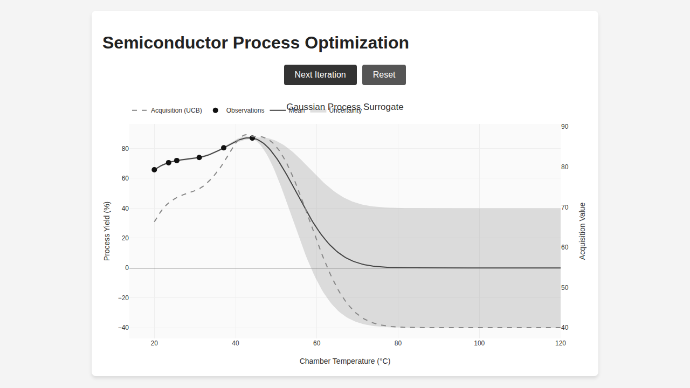

# Bayesian Optimization Demo

This repository demonstrates how to use a Gaussian Process Surrogate model to perform Bayesian optimization.

## Use Case: Semiconductor Process Optimization

In this example case, the application attempts to optimize process yield by searching for the ideal **Chamber Temperature (°C)**. The simulation includes a nonlinear base yield, a parabolic penalty moving away from the optimal point (~75°C), and some sinusoidal noise, reflecting real-world variability in manufacturing.

The application implements the **Upper Confidence Bound (UCB)** acquisition function to balance exploration (checking regions with high uncertainty) and exploitation (checking regions with high predicted yield).

## Demo



## Getting Started

1. Initialize the modules:
   ```bash
   go mod init bayesopt
   go get gonum.org/v1/gonum/...
   ```
2. Build and run the app:
   ```bash
   go build main.go
   ./main
   ```
3. Open `http://localhost:8080` in your web browser.

## Flexible Generics

The backend Gaussian Process engine uses Go Generics (`GP[T any]`) and is fully flexible to take any kind of data input, provided a suitable kernel function is written to compare elements.

Here are a few examples of initializing the GP with various input types.

### 1. Numeric Inputs (Default Demo)
The standard use case takes a slice of floats representing continuous variables (like temperature, pressure, etc).

```go
kernel := RBFKernel(10.0, 20.0) // Returns func(x1, x2 []float64) float64
gp := NewGP(10.0, 20.0, 1e-1, kernel)

obsX := [][]float64{{20.0}, {45.5}}
obsY := []float64{65.7, 98.2}
gp.Fit(obsX, obsY)
```

### 2. Image and Audio Inputs
Media files can be ingested as standard byte slices. The `ByteKernel` calculates simple distance over the byte stream structure.

```go
// Read an image or audio file into a byte array
data1 := []byte{0xFF, 0xD8, 0xFF, 0xDB, ...}
data2 := []byte{0xFF, 0xD8, 0xFF, 0xE0, ...}

kernel := ByteKernel(10.0, 20.0) // Returns func(x1, x2 []byte) float64
gp := NewGP(10.0, 20.0, 1e-1, kernel)

gp.Fit([][]byte{data1, data2}, []float64{15.0, 99.1})
```

### 3. Mixed Input Types
You can easily optimize over multiple input domains simultaneously (e.g. searching for the ideal hardware settings to encode a specific image) by using a struct and a composite kernel.

```go
type MixedData struct {
	HardwareParams []float64
	Image          []byte
}

compositeKernel := func(x1, x2 MixedData) float64 {
	// Compare numeric parameters
	rbfScore := RBFKernel(1.0, 1.0)(x1.HardwareParams, x2.HardwareParams)

	// Compare image bytes
	imgScore := ByteKernel(1.0, 1.0)(x1.Image, x2.Image)

	// Composite result (multiplicative or additive depending on domain needs)
	return rbfScore * imgScore
}

gp := NewGP(1.0, 1.0, 1e-1, compositeKernel)
```
